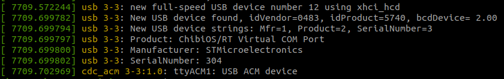
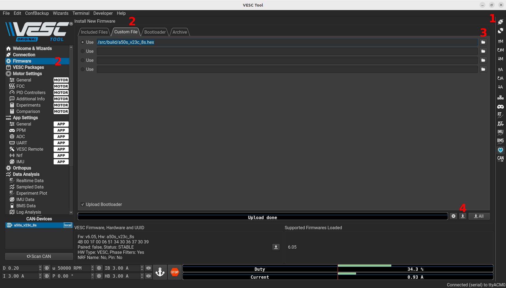
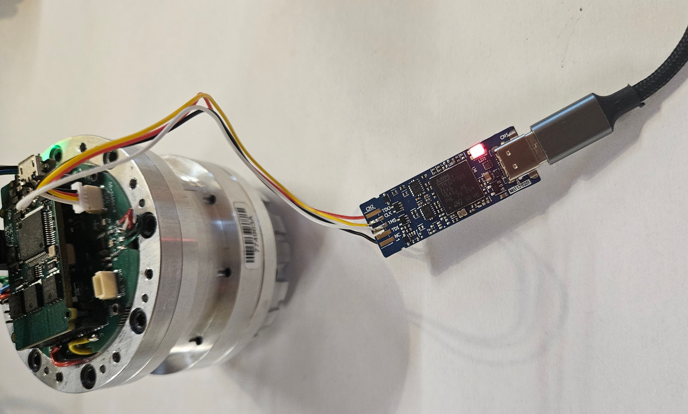
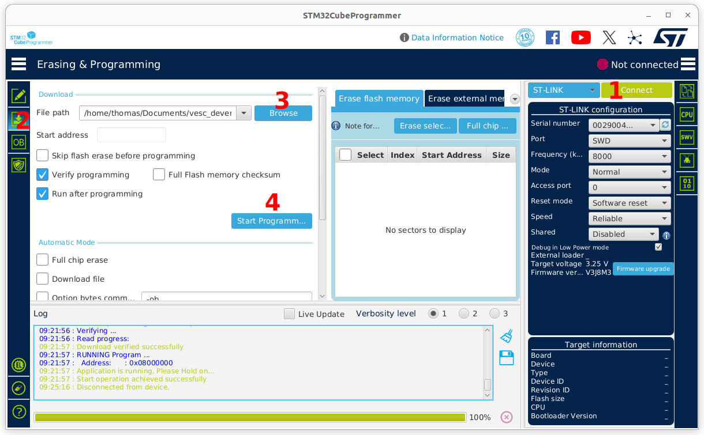

## First install:

# You need a valid bitbucket account with acces to ORTHOPUS repositories


pull all the git repositories and submodules with:
```
(HOST)
./setup_devenv.sh
```

build the docker image that will contain the toolchain required to build vesc_tool and the vesc firmware.

(however, you can install the tools directly on your computer, withour docker, have a look at the dockerfile to know the required dependancies)
```
(HOST)
./docker-build-vesc.sh
```

run container:
```
(HOST)
./docker-run-vesc.sh
```
you will en up in a shell inside your contaier (CONT), showing something like:

```
root@thomas-Precision-3560:/src#
```

If you need another terminal inside the container, you can use:

```
(CONT)
./docker-exec-vesc.sh
```

## VESC_tool:

build vesc_tool (this will take a while)

```
(CONT)
./build_vesc_tool.sh
```

now, you can run VESC_tool using:

```
(CONT)
./vesc_tool.sh
```

the VESC_tool GUI should start. You can connect with USB or CAN (setup CAN bus with ./setcan0_1M.sh) to the actuators.

## VESC_bldc (firmware):

Still in the container, you can build the firmware:

install the sdk (need to do it only once):
```
(CONT)
./install_sdk.sh
```

build the firmware for actuators V3

```
(CONT)
./make_fw_a50s_v23c_8s.sh
```

you can flash this firmware with VESC_tool, it has been copied in the build/ folder.


## Troubleshooting :

### Controller not responding - impossible to connect even with USB

First you can check if the controller enumerate correctly: Plug in a USB cable directly on the actuator controller, make sure that at least one LED is ON (if not, check your USB cable).

Run the command:
```
sudo dmesg
```

If everything is fine, it should return something like:



If it is not recognized as a USB ACM device, there might be an issue with the firmware, you can flash it with an STM32 programmer (see dedicated section)

## Flash with VESC_tool :

Before flashing, you might want to backup your motorconf, appconf and orthopus conf XML files to set those back later

1. connect to the actuator (USB or CAN)
2. Go to the "firmware section" and select "Custom File"
3. If you built the firmware with the script `make_fw_a50s_v23c_8s.sh` , the firmware to use is in `/src/build/a50s_v23c_8s.hex`
4. Click on the update firmware button next to the progress bar
5. wait during the flash process, do not unplug
6. Once the flash process is done, wait 30s to let it reboot and you can connect to it again.

Don't forget to restore the configurations.



## Flash with STM32 programmer :

You will need a STLINK programmer. We currently use an STLINK-V3MINIE



Install STM32 Cube programmer:
https://www.st.com/en/development-tools/stm32cubeprog.html

connect to the target, choose the firmware hex file and flash:



If the connection fails, check your cables, there should be some LEDS ON on the controller and the STLINK. If everything is properly connected and still can't connect, the controller might be damaged.

After you flashed the firmware, you should be able to see correct output of dmesg and connect with VESC_tool.

## Developers :
### Add a parameter to the ORTHOPUS config:  
- add the paramter to orthopus_config_t
- in VESC_tool, go to Developper/Parameter Editor Custom conf 0 (with a VESC plugged with the current firmware if you want to take this config as default, otherwise, load XML orthopus_settings.xml)
- in the central screen, replace new_parameter with yours, you xan set the type, the default value and boundaries. Name is the variable name (the same you set in orthopus_config_t), Long Name is the displayed name
- in Misc, set the C Definre: ORTHOPUS_CFG_DEF_YOUR_VARIABLE_NAME
- save and then check everything looks good in Preview tab
- on the left column, place your parameter at the end of the list
- on the right column, add it ti the serialization with +
- in the Grouping tab, add your parameter in a category (or create one) so that it will appear in VESC_tool
- in Tools/Save XML and export config, ... -> choose your orthopus_settings.xml file to replace
- it will ask for a prefix, set "orthopus_"
- in applications/orthopus/_gen, you should see all the files modified, with your parameter added, the signature modified other files updated.
- Flash and test.